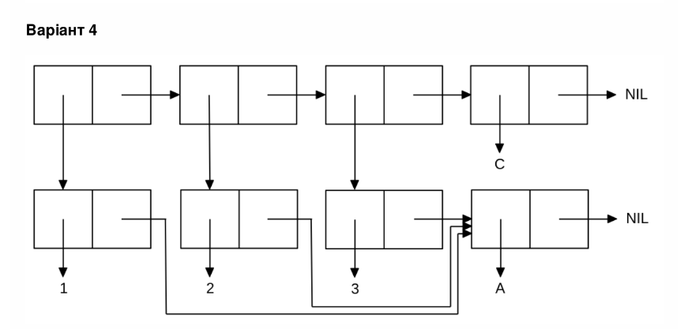

<p align="center"><b>МОНУ НТУУ КПІ ім. Ігоря Сікорського ФПМ СПіСКС</b></p>
<p align="center">
<b>Звіт з лабораторної роботи 1</b><br/>
"Обробка списків з використанням базових функцій"<br/>
дисципліни "Вступ до функціонального програмування"
</p>
<p align="right">**Студент**: *Горбик Данііл Васильович КВ-13*<p>
<p align="right">**Рік**: *2024*<p>
## Загальне завдання

1. Створіть список з п'яти елементів, використовуючи функції LIST і CONS . Форма створення списку має бути одна — використання SET чи SETQ (або інших допоміжних форм) для збереження проміжних значень не допускається. Загальна кількість елементів (включно з підсписками та їх елементами) не має перевищувати 10-12 шт. (дуже великий список робити не потрібно). Збережіть створений список у якусь змінну з SET або SETQ . Список має містити (напряму або у підсписках):
   - хоча б один символ
   - хоча б одне число
   - хоча б один не пустий підсписок
   - хоча б один пустий підсписок
2. Отримайте голову списку.

3. Отримайте хвіст списку.

4. Отримайте третій елемент списку.

5. Отримайте останній елемент списку.

6. Використайте предикати ATOM та LISTP на різних елементах списку (по 2-3 приклади для кожної функції).

7. Використайте на елементах списку 2-3 інших предикати з розглянутих у розділі 4 навчального посібника.

8. Об'єднайте створений список з одним із його непустих підсписків. Для цього використайте функцію APPEND.

```lisp
(defvar my-list nil)
(setq my-list
    (list 'x
          8
          'y
          (list 'a 'b 'c)
          (list 'w 'z (list 2 5) nil)))

(format t "~%1. Printing my-list")
(print my-list)
(format t "~%2. Printing head of my-list")
(print (car my-list))
(format t "~%3. Printing tail of my-list")
(print (cdr my-list))
(format t "~%4. Printing third element of my-list")
(print (nth 2 my-list))
(format t "~%5. Printing last element of my-list")
(print (car (last my-list)))

(format t "~%6.1.1 Printing check ATOMarity of first element of my-list => 'X' ")
(print (atom (car my-list)))
(format t "~%6.1.2 Printing check ATOMarity of fourth element of my-list => '(A B C)' ")
(print (atom (nth 3 my-list)))
(format t "~%6.1.3 Printing check ATOMarity of last element of my-list 'NIL' ")
(print (atom (car (last my-list))))

(format t "~%6.2.1 Printing check LISTParity of first element of my-list => 'X' ")
(print (listp (car my-list)))
(format t "~%6.2.2 Printing check LISTParity of fourth element of my-list => '(A B C)' ")
(print (listp (nth 3 my-list)))
(format t "~%6.2.3 Printing check LISTParity of last element of my-list 'NIL' ")
(print (listp (car (last my-list))))

(format t "~%7.1.1 Printing check EQLarity of first element of my-list => 'X' and 'x' ")
(print (eql (car my-list) 'x))
(format t "~%7.1.2 Printing check EQLarity of second element of my-list => '8' and 8.0 ")
(print (eql (second my-list) 8.0))
(format t "~%7.1.3 Printing check EQLarity of fourth element of my-list => '(A B C)' and (A B C) ")
(print (eql (nth 3 my-list) '('a 'b)))

(format t "~%7.2.1 Printing check NULLarity of first element of my-list => 'X' ")
(print (eql (car my-list) 'x))
(format t "~%7.2.2 Printing check NULLarity of fourth element of my-list => '(A B C)' ")
(print (eql (nth 3 my-list) 8.0))
(format t "~%7.2.3 Printing check NULLarity of last element of my-list 'NIL' ")
(print (eql (car (last my-list)) '('a 'b)))

(format t "~%7.3.1 Printing check EQUALParity of first element of my-list => 'X' and x ")
(print (equalp (car my-list) 'x))
(format t "~%7.3.2 Printing check EQUALParity of second element of my-list => '8' and 8.0 ")
(print (equalp (second my-list) 8.0))
(format t "~%7.3.3 Printing check EQLUALParity of fourth element of my-list => '(A B C)' and (A B C) ")
(print (equalp (nth 3 my-list) (list 'a 'b 'c)))


(format t "~%8. Printing appended my-list with fourth element of my list => '(A B C)' ")
(print (append my-list (nth 3 my-list)))
(format t "~%9. Resolving task")


(defvar cellA (cons 'a nil))

(setq my-list
  (list
   (cons 1 cellA)
   (cons 2 cellA)
   (cons 3 cellA)
   'c
   ))

(print my-list)
```

## Варіант <4>

<p align="center">

</p>
## Завдання за варіантом №1
Створіть список, що відповідає структурі списку, наведеній на рисунку (за варіантом). Для цього допускається використання не більше двох форм. Номер варіанту обирається як номер у списку групи, який надсилає викладач на початку семестру (на випадок, якщо протягом семестру стануться зміни в складі групи), за модулем 8: 1 -> 1, 2 - > 2, ..., 9 -> 1, 10 -> 2, ... 
Примітка: на рисунках однакові імена символів можуть бути позначені в кількох місцях, проте, загалом, вони позначають один і той самий символ.

```lisp
(defvar cellA (cons 'a nil))


(setq my-list
  (list
   (cons 1 cellA)
   (cons 2 cellA)
   (cons 3 cellA)
   'c
   ))

(print my-list)
```

## Результат виконання програми

```
1. Printing my-list
(X 8 Y (A B C) (W Z (2 5) NIL))
2. Printing head of my-list
X
3. Printing tail of my-list
(8 Y (A B C) (W Z (2 5) NIL))
4. Printing third element of my-list
Y
5. Printing last element of my-list
(W Z (2 5) NIL)
6.1.1 Printing check ATOMarity of first element of my-list => 'X'
T
6.1.2 Printing check ATOMarity of fourth element of my-list => '(A B C)'
NIL
6.1.3 Printing check ATOMarity of last element of my-list 'NIL'
NIL
6.2.1 Printing check LISTParity of first element of my-list => 'X'
NIL
6.2.2 Printing check LISTParity of fourth element of my-list => '(A B C)'
T
6.2.3 Printing check LISTParity of last element of my-list 'NIL'
T
7.1.1 Printing check EQLarity of first element of my-list => 'X' and 'x'
T
7.1.2 Printing check EQLarity of second element of my-list => '8' and 8.0
NIL
7.1.3 Printing check EQLarity of fourth element of my-list => '(A B C)' and (A B C)
NIL
7.2.1 Printing check NULLarity of first element of my-list => 'X'
T
7.2.2 Printing check NULLarity of fourth element of my-list => '(A B C)'
NIL
7.2.3 Printing check NULLarity of last element of my-list 'NIL'
NIL
7.3.1 Printing check EQUALParity of first element of my-list => 'X' and x
T
7.3.2 Printing check EQUALParity of second element of my-list => '8' and 8.0
T
7.3.3 Printing check EQLUALParity of fourth element of my-list => '(A B C)' and (A B C)
T
8. Printing appended my-list with fourth element of my list => '(A B C)'
(X 8 Y (A B C) (W Z (2 5) NIL) A B C)
9. Resolving task
((1 A) (2 A) (3 A) C)

```
